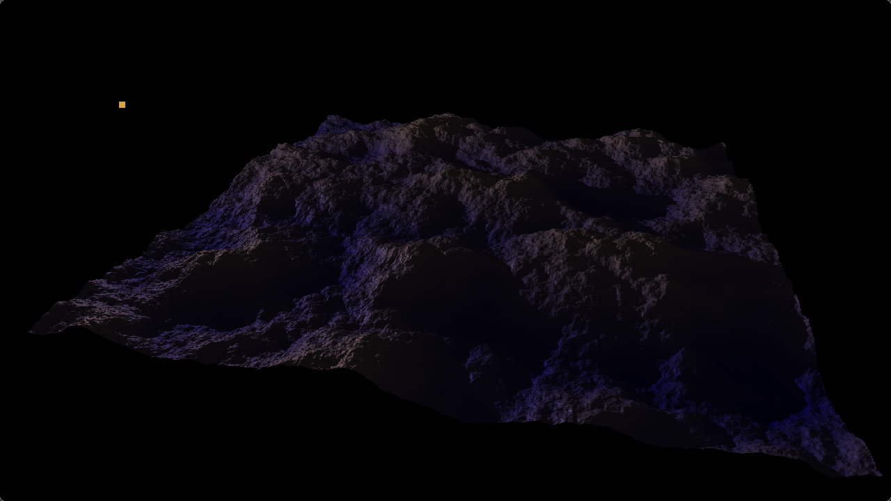
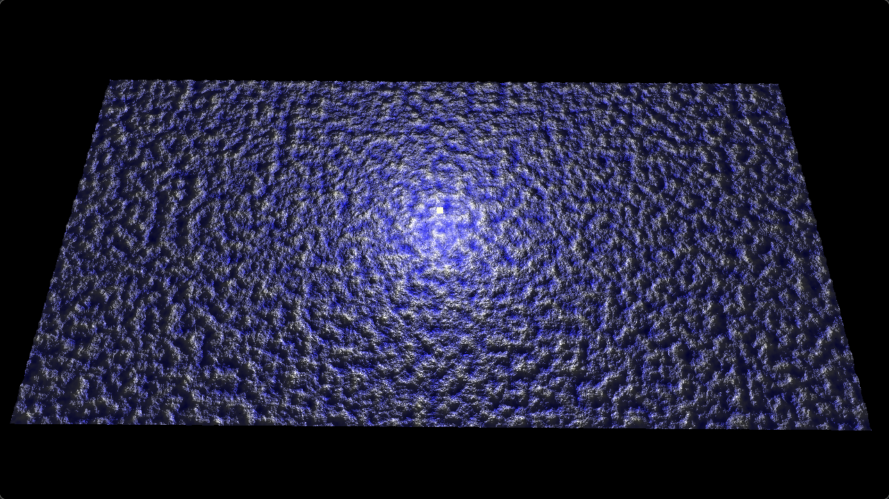

# Real-time Shadow Simulator

Generates several tiles of grids containing Perlin noise, and then renders them with shadows.

## Running

The shader files (`src/*.{frag,vert,geom}`) are referenced within the code by assuming they are located in the current
working directory.
It is therefore necessary to set the CWD when running the program to the `src/` directory, or copy/symlink the files to
whatever your actual CWD is.

## Control

Sample from console output:

```
Mouse control:
	Click and drag to rotate camera

Keyboard control (case-insensitive):
	x, q, [ESC]: Quit program
	r: Regenerate terrain

	wasd: Move forward/left/backward/right relative to the camera
	cz: Move up/down relative to the world

	k: Toggle point light following camera
	l: Toggle phong light simulation
	m: Toggle shadows
	n: Toggle ground/normal colour
	p: Toggle day/night cycle
```

## Example Outputs

### Sunset

This image shows a "sunset".
Contains `4x4` tiles each containing `(1<<9)^2` points, for a total of 4,194,304 vertices.
Shadows update in real-time with sun position.



### Stress Test

Putting as many vertices as we can on the shader.
Contains `32x64` tiles each containing `(1<<8)^2` points for a total of 134,217,728 vertices.
Renders at several frames per second on a 6950XT and uses roughly 7.7GiB of VRAM.


